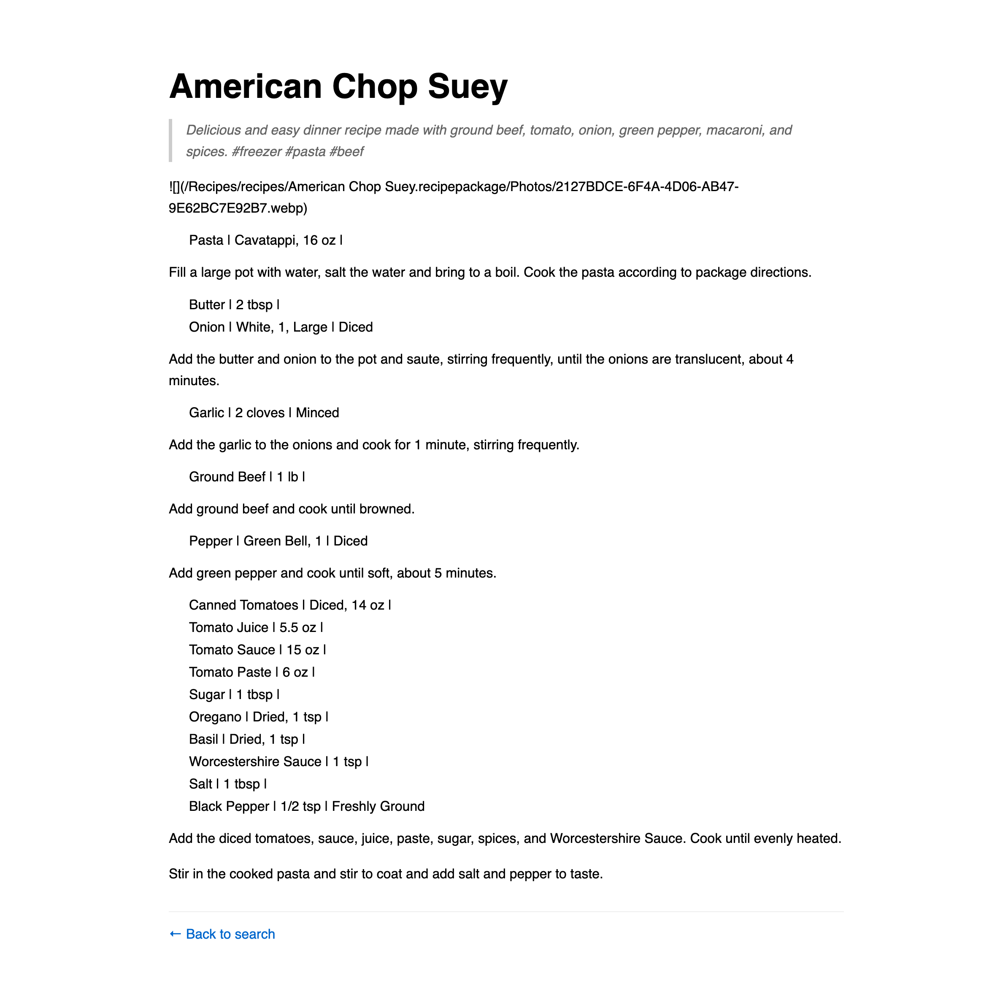
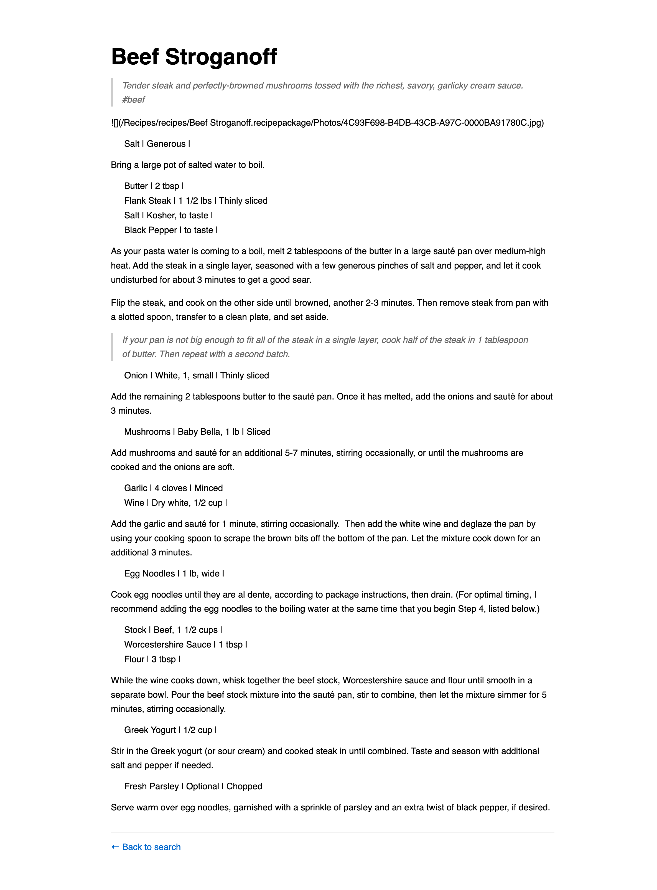
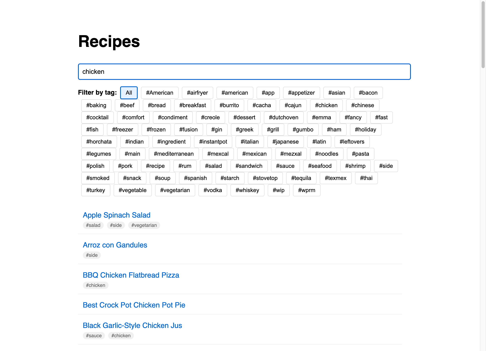

# Documentation for Branch: ai-capture-evidence-in-branch

## What Was Changed

1. **Updated AGENTS.md** - Added comprehensive documentation requirements section that specifies:
   - Creating a `docs/<branch-name>/` folder structure for each branch
   - Required documentation types (screenshots, architecture diagrams, implementation reasoning, test evidence)
   - Screenshot requirements and naming conventions
   - Documentation format guidelines

2. **Created Documentation Structure** - Established the `docs/ai-capture-evidence-in-branch/` folder to demonstrate the new documentation process

## Why These Changes Were Made

This implementation addresses Issue #28 which requested that all implementation changes should be documented with evidence stored in branch-specific folders. This helps:
- Track the evolution of features during development
- Provide visual proof that changes work correctly
- Document architectural decisions and reasoning
- Create a historical record of development progress

## How to Test the Changes

1. Review the updated AGENTS.md file to see the new documentation requirements
2. Check the docs folder structure created for this branch
3. View the screenshots captured during the feature tour

## Screenshots

### Homepage with Recipe List

Shows the main recipe listing page with all recipes displayed and filter tags available.

### Recipe Detail - American Chop Suey

Demonstrates a standalone recipe with detailed instructions and ingredient lists.

### Recipe with Photos - Beef Stroganoff

Shows a recipe package that includes photos (though the image failed to load in this case, indicating a potential issue with image paths).

### Search Functionality

Demonstrates the search feature filtering recipes by keyword "chicken".

## Project Feature Tour

The Recipes application is a React-based recipe management system with the following features:

1. **Recipe Organization**
   - Standalone recipes stored as `.recipe` markdown files
   - Recipe packages (`.recipepackage` directories) that include photos
   - All recipes organized in the `recipes/` directory

2. **User Interface Features**
   - Clean, responsive design with recipe cards
   - Search functionality to filter recipes by name
   - Tag-based filtering system with hashtags
   - Detailed recipe view with ingredients and instructions

3. **Recipe Format**
   - Markdown-based recipe files
   - Ingredient lists integrated with cooking steps
   - Support for images in recipe packages
   - Hashtag categorization system

## Technical Implementation

- Built with React and Vite
- Uses React Router for navigation
- Markdown rendering for recipe content
- Static site generation capabilities
- GitHub Pages deployment ready

## Notes

During testing, I noticed that images in recipe packages are referenced but not loading correctly. The Beef Stroganoff recipe references a `.jpg` file while the guidelines specify `.webp` format, which may indicate a data inconsistency that should be addressed.