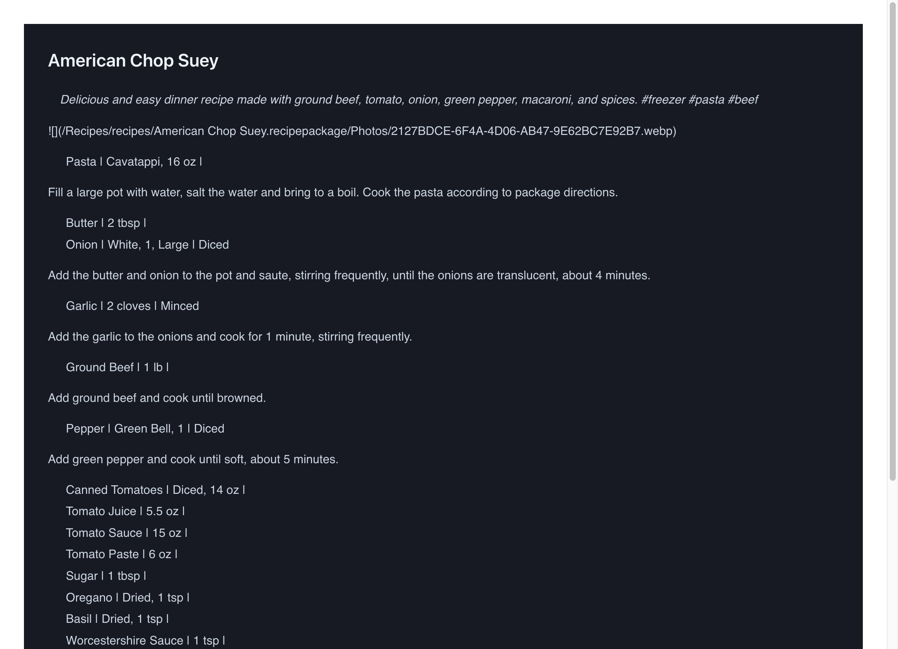

# Fix Site Down - Chakra UI v3 Compatibility

## What was changed

1. **Added development scripts to package.json**
   - Added `dev` script to run Vite development server
   - Added `preview` script to preview production builds

2. **Fixed Chakra UI v3 component compatibility issues**
   - Removed `Link` component imports (not available in Chakra UI v3)
   - Removed `Alert` component import (changed API in v3)
   - Removed `List` and `ListItem` component imports (not available in v3)
   - Replaced all instances with `Box` component using appropriate `as` prop

## Why the changes were made

The site was broken due to incompatibility issues after upgrading to Chakra UI v3. Several components that existed in v2 were either removed or had their API changed in v3:
- `Link`, `List`, `ListItem`, and `Alert` components are no longer exported from `@chakra-ui/react` v3
- These needed to be replaced with the more flexible `Box` component

Additionally, there was no `dev` script in package.json, making local development difficult.

## How to test the changes

1. Install dependencies: `npm install`
2. Run development server: `npm run dev`
3. Open browser to http://localhost:5173/Recipes/
4. Verify the homepage loads and displays recipes
5. Click on any recipe to verify recipe detail pages work
6. Test tag filtering functionality

## Screenshots

### Homepage Working

Shows the recipe list page functioning correctly with all recipes displayed.

### Recipe Detail Page Working  

Shows a recipe detail page rendering correctly with ingredients and instructions.

## Files Modified

- `package.json` - Added dev and preview scripts
- `src/pages/SearchPage.tsx` - Fixed Chakra UI v3 component compatibility
- `src/pages/RecipePage.tsx` - Fixed Chakra UI v3 component compatibility