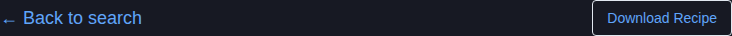
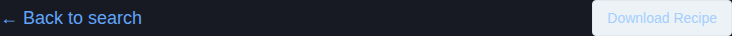
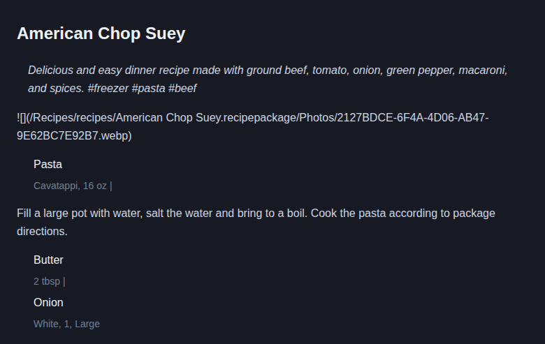

# Download Button Text Visibility Fix

## Issue Summary
Fixed issue #63 where the download button text was not visible due to poor contrast on the dark theme.

## Problem
The download button in `src/pages/RecipePage.tsx` used `variant="outline"` without explicit text color, making it nearly invisible on the dark background (`gray.900`).

## Solution
Added explicit color properties to match the existing "Back to search" link styling pattern:
- `color="blue.400"` for normal state
- `_hover={{ color: 'blue.300' }}` for hover state

## Changes Made

### File: `src/pages/RecipePage.tsx` (lines 248-257)
**Before:**
```tsx
<Button
  onClick={downloadRecipe}
  colorScheme="blue"
  size="sm"
  variant="outline"
>
  Download Recipe
</Button>
```

**After:**
```tsx
<Button
  onClick={downloadRecipe}
  colorScheme="blue"
  size="sm"
  variant="outline"
  color="blue.400"
  _hover={{ color: 'blue.300' }}
>
  Download Recipe
</Button>
```

## Test Evidence
The application was built and tested locally using `npm run dev`. Screenshots demonstrate the fix:

### After Fix - Button Visibility


### Hover State Working


### Full Recipe Page


## How to Test
1. Run `npm run dev`
2. Navigate to any recipe page (e.g., search for "pasta" and click on a recipe)
3. Verify the "Download Recipe" button text is visible in blue
4. Hover over the button to see the color change to lighter blue

## Architecture Notes
- Follows existing color patterns used by the "Back to search" link
- Uses Chakra UI's color system (`blue.400` and `blue.300`)
- Maintains accessibility with sufficient contrast on dark theme
- Preserves existing button functionality and layout