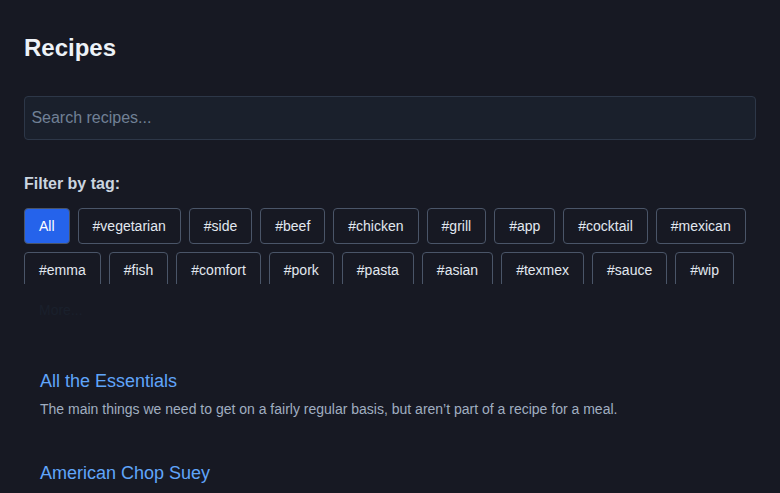
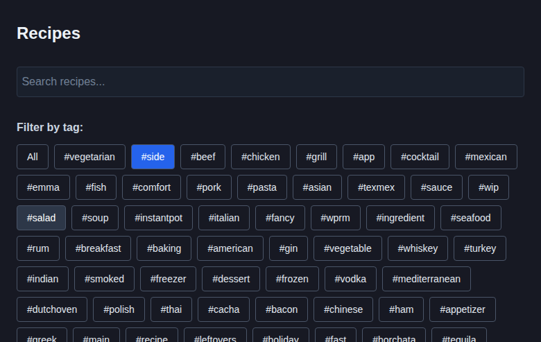

# Tag List Update Documentation

## Issue #68: Update tag list in search

### What was changed
Updated the tag list display in the search page (`src/pages/SearchPage.tsx`) to:
1. Display tags in a 2-line flexible layout instead of horizontal scroll
2. Sort tags by frequency (most used tags appear first)
3. Add a "More..." button to expand/collapse the tag list

### Implementation details
- Calculated tag frequencies from recipe data during load
- Changed from horizontal scrollable container to flex wrap layout
- Set maximum height of 76px (~2 lines) in collapsed state
- Added state management for expand/collapse functionality
- Maintained all existing tag filtering functionality

### How to test
1. Run `npm install` to install dependencies
2. Run `npm run build` to build the application
3. Run `npm run preview` to start the preview server
4. Navigate to http://localhost:4173
5. Observe the tag list shows approximately 2 lines of tags
6. Click "More..." to expand and see all tags
7. Click "Show less" to collapse back to 2 lines
8. Verify tags are sorted by frequency (most common tags appear first)

### Screenshots

#### Collapsed state (showing 2 lines of tags)

#### Expanded state (showing all tags)

### Technical changes
- Added `showAllTags` state to track expand/collapse
- Modified tag loading to calculate frequencies from recipe data
- Replaced horizontal scroll container with `Flex` component using `flexWrap`
- Added conditional `maxH` property to limit height when collapsed
- Added "More..."/"Show less" button with toggle functionality