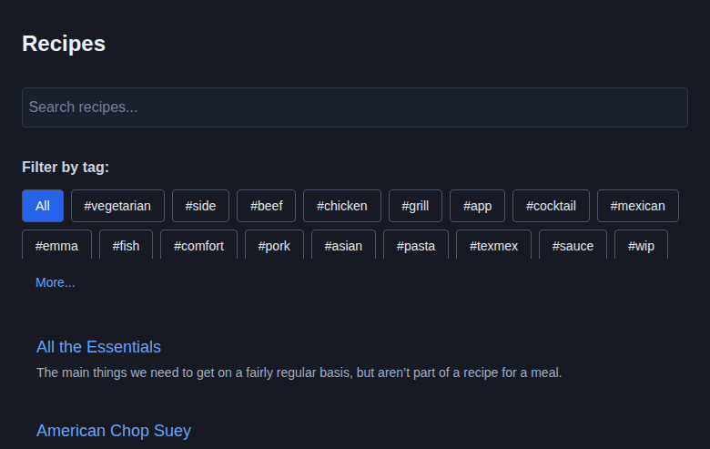
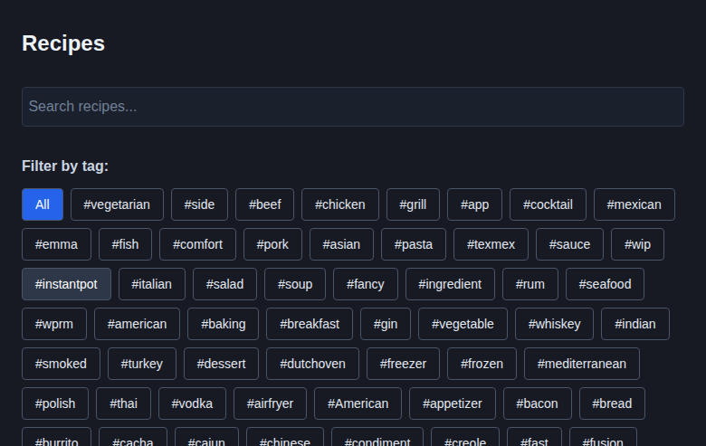

# Tag List Update Documentation

## Overview
Updated the tag list in the search page to show 2 lines of tags sorted by frequency, with a "More..." button to expand/collapse the full list.

## Changes Made
1. **Tag sorting by frequency**: Tags are now sorted by how often they appear in recipes (most frequent first)
2. **Two-line layout**: Changed from horizontal scroll to flex wrap layout showing approximately 2 lines of tags
3. **More/Show less button**: Added a button to expand and collapse the tag list

## Screenshots

### Collapsed View (2 lines with "More..." button)

The tag list shows approximately 2 lines of tags with the "More..." button visible at the bottom.

### Expanded View (All tags visible)

When the "More..." button is clicked, all tags are displayed in a wrapped layout. The button text changes to "Show less" to allow collapsing back to 2 lines.

## How to Test
1. Run `npm install` to install dependencies
2. Run `npm run dev` to start the development server
3. Navigate to `http://localhost:5173/Recipes/#/search`
4. Observe the tag list showing 2 lines with a "More..." button
5. Click "More..." to expand and see all tags
6. Click "Show less" to collapse back to 2 lines

## Technical Details
- Tags are sorted by frequency (most used tags appear first)
- The collapsed view has a max height of 76px (approximately 2 lines)
- The "More..." button only appears when there are more than 10 tags
- Implemented in `/src/pages/SearchPage.tsx`