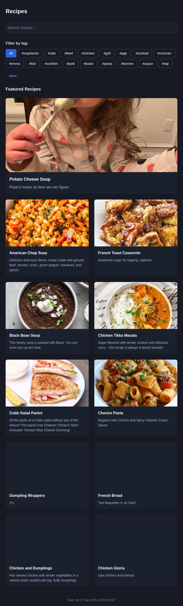

# Dedicated Landing Page and Search Experiences

## What was changed
- Modified `src/pages/SearchPage.tsx` to add a dedicated landing page experience
- Landing page now shows 11 random recipes with photos and descriptions in a news-style grid layout
- Adjusted recipe count to ensure the final row is always complete (1 hero + 10 in 2-column grid = 5 complete rows)
- When users search or filter, the view switches to the existing list layout showing all matching recipes

## Why the changes were made
The user requested a better landing page experience that:
- Shows featured recipes with pictures and descriptions
- Displays them like a news front page (no tags, just name, description, and picture)
- Keeps the existing search/filter experience with the current layout
- Later adjusted count from 10 to 11 to ensure final row is always complete in the 2-column layout

## Implementation details
- Added logic to detect when the user is on the landing page (no search query and no tag filter)
- Extract first image from recipe content for display in the featured grid
- Created a responsive grid layout with the first recipe featured larger than others
- Maintained all existing functionality for search and filtering

## How to test the changes
1. Install dependencies: `npm install`
2. Build the project: `npm run build`
3. Run the preview server: `npm run preview`
4. Navigate to http://localhost:4173/Recipes/
5. Verify the landing page shows 11 random recipes with photos (1 hero + 10 in grid)
6. Try searching for recipes or clicking tags to see the list view
7. Clear search/filters to return to the landing page

## Screenshots
- **Landing Page**: Shows the new featured recipes grid layout
  

- **Updated Landing Page**: Shows 11 recipes with complete final row
  

- **Search Results**: Shows recipes matching search term "chicken" in list view
  

- **Filter Results**: Shows recipes filtered by "vegetarian" tag in list view
  