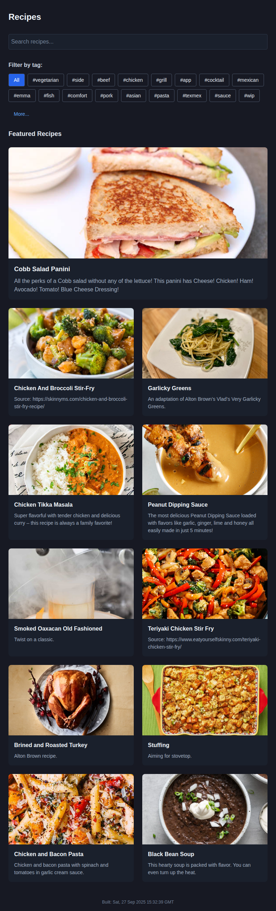

# Predictable Featured Recipes Implementation

## What was changed
Implemented a date-based deterministic selection system for featured recipes on the landing page. The featured recipes now consistently show the same selection for any given date, while appearing random and changing daily.

## Why the changes were made
Previously, featured recipes were selected randomly using `Math.random()`, which meant:
- Different users saw different featured recipes on the same day
- Refreshing the page would show different recipes
- There was no consistency in the featured content

This change was requested in issue #80 to make featured recipes predictable and consistent for all users on any given day.

## Implementation Details

### Algorithm Components
1. **Seeded Pseudo-Random Number Generator**: Uses a mathematical sine-based function to generate deterministic pseudo-random numbers from a seed value
2. **String Hash Function**: Converts date strings into numeric hash values using a bit-shifting algorithm
3. **Deterministic Shuffle**: Implements Fisher-Yates shuffle algorithm with the seeded random generator to ensure consistent shuffling

### How it Works
1. The current date is converted to a string format (YYYY-M-D)
2. The date string is hashed to create a numeric seed
3. This seed is used to deterministically shuffle the array of recipes with photos
4. The first 11 recipes from the shuffled array are selected as featured

### Benefits
- **Consistency**: All users see the same featured recipes on any given day
- **Daily Rotation**: Featured recipes automatically change every 24 hours
- **Predictability**: The selection can be reproduced for any given date
- **Pseudo-randomness**: The selection appears random while being deterministic

## How to test the changes
1. Run the development server: `npm run dev`
2. Navigate to the homepage at http://localhost:5173/Recipes/
3. Observe the featured recipes displayed
4. Refresh the page multiple times - the same recipes should appear
5. To verify daily changes, you can temporarily modify the date calculation in the code to test different dates

## Screenshots

*The landing page showing deterministically selected featured recipes*

## Technical Notes
- The implementation is purely client-side and doesn't require server changes
- The algorithm is efficient with O(n) time complexity for shuffling
- The hash function provides good distribution of seed values
- TypeScript types are properly maintained throughout the implementation